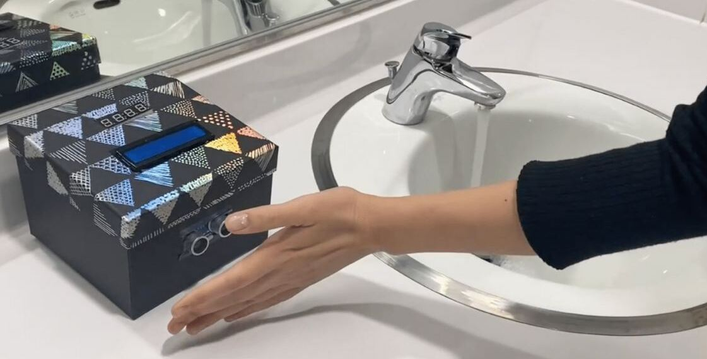
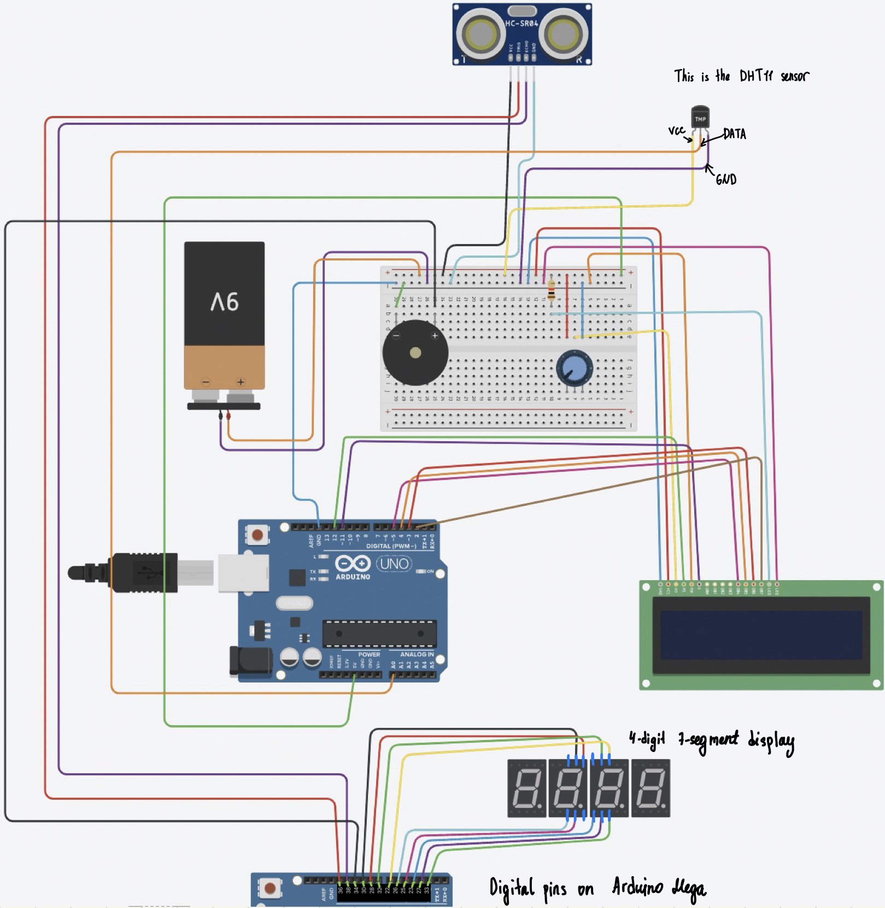

# Hand Wash Timer
    
Welcome to the Touchless Musical Hand Wash Timer project! Our goal is to help stop the spread of Covid-19 and improve hygiene discipline in a fun and interesting way. This is the final project of the team LG for Creative ISE Design class.

This touchless hand wash timer displays a countdown clock to remind users to wash their hands for the recommended amount of time, and also displays the room's humidity and temperature. Additionally, it plays music while the timer is running to make the hand washing process more enjoyable.

The target audience for this project is students at INHA University, and it can be used in the university's restrooms. Our aim is to raise awareness about the importance of handwashing and encourage people to adopt proper hygiene habits.

We hope you find this project useful and informative. Thank you for your interest!    

## Hardware Requirements
* Arduino Board (Mega)
* Ultrasonic Sensor
* Buzzer
* 4-Digit 7 Segment Display
* Humidity Sensor
* LCD Display  
* 10K Potentiometer
* Battery holder with batteries

## Software Requirements
* Sevseg
* DHT
* Adafruit-GFX
* Adafruit-LED-Backpack
* Adafruit-BusIO 

## Usage
1. Place your hand under the infrared sensor to start the hand-washing timer and music.
2. Wash your hands for at least 20 seconds while the music plays.
3. The music will stop automatically after 20 seconds.

## Notes
* Make sure the infrared sensor is positioned at a distance that allows it to accurately detect the presence of a hand.
* The volume of the music may need to be adjusted depending on the type of speaker or buzzer used.    
     
## Circuit

## Demo
You can check out out demo video [here](https://www.youtube.com/watch?v=D734M-M7Pic&ab_channel=GulizaAitkulova).
    
## References
* https://create.arduino.cc/projecthub/sridhar-rajagopal/touchless-musical-hand-wash-timer-766972 
* https://www.youtube.com/watch?v=b7yCvvrDPSw&t=1s&ab_channel=PaulMarriott-CHANNELofSTUFF 
* https://www.youtube.com/watch?v=fYAlE1u5rno&t=38s&ab_channel=STEMBasics 
* https://create.arduino.cc/projecthub/techno_z/dht11-temperature-humidity-sensor-98b03b?ref=tag&ref_id=humidity&offset=0
* https://docs.arduino.cc/learn/electronics/lcd-displays 
* https://www.youtube.com/watch?v=ep7uBz43fCI&ab_channel=PaulMcWhorter
   
## Contibutors
* Guliza Aitkulova
* Leyla Khamidova
* Shokhrukh Komiljonov
